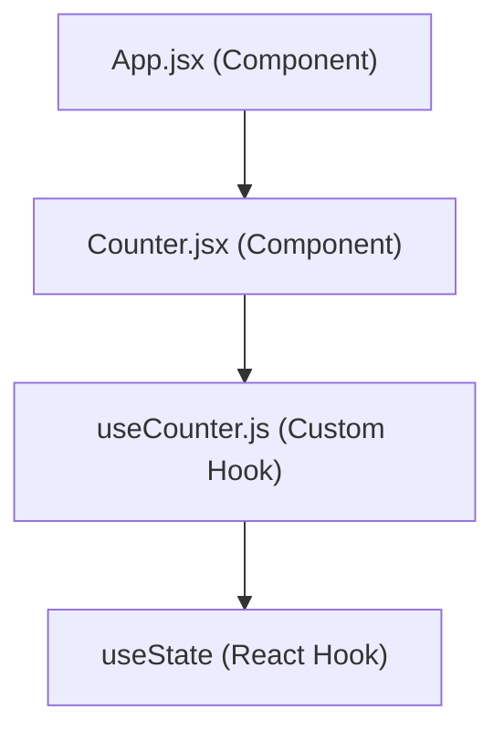

# Counter Component Architecture in This Project

## 1. How `App.jsx` Connects to `Counter.jsx`

- `App.jsx` imports the `Counter` component from `src/components/Counter.jsx`.
- It renders `<Counter />` multiple times, passing different `startCounterFrom` props.
- This means `App.jsx` is the parent, and `Counter.jsx` is a child component.

**Why?**

- To reuse the same counter logic with different initial values.

**How?**

- By passing props from parent (`App.jsx`) to child (`Counter.jsx`).

---

## 2. How `Counter.jsx` Connects to `useCounter.js`

- `Counter.jsx` imports the `useCounter` custom hook from `src/hooks/useCounter.js`.
- It calls `useCounter(startCounterFrom)` to get `count`, `incrementCounter`, and `decrementCounter`.
- These are used to display and update the counter in the UI.

**Why?**

- To encapsulate and reuse counter logic in a clean, testable way.

**How?**

- By calling the custom hook inside the component and using its returned values.

---

## 3. Definitions

| Term        | Definition                                                                                                                          |
| ----------- | ----------------------------------------------------------------------------------------------------------------------------------- |
| Component   | A reusable, isolated piece of UI in React. Can be a function or class.                                                              |
| Hook        | A special function in React (like `useState`, `useEffect`) that lets you use state and other React features in function components. |
| Custom Hook | Your own function that uses React hooks to encapsulate reusable logic. Must start with `use`.                                       |

---

## 4. Rules for Using Custom Hooks

- Custom hooks **must** start with `use` (e.g., `useCounter`).
- They can call other hooks (like `useState`, `useEffect`).
- Only call hooks at the top level of your function (not inside loops, conditions, or nested functions).
- Custom hooks return values (state, functions) that your component can use.

---

## 5. Comparison Table: Component vs. Hook vs. Custom Hook

| Feature         | Component       | Hook               | Custom Hook  |
| --------------- | --------------- | ------------------ | ------------ |
| Purpose         | UI + logic      | Add React features | Reuse logic  |
| Usage           | `<Component />` | `useX()`           | `useX()`     |
| Returns         | JSX (UI)        | Value(s)           | Value(s)     |
| Can use hooks?  | Yes             | N/A                | Yes          |
| Must start with | Capital letter  | `use`              | `use`        |
| Example         | `Counter`       | `useState`         | `useCounter` |

---

## 6. Mermaid Diagram

---

## 7. Flow Explanation

- `App.jsx` renders `Counter` components.
- Each `Counter` uses the `useCounter` custom hook for its logic.
- `useCounter` uses React's built-in `useState` hook to manage the counter state.

---

**Summary:**

- `App.jsx` is the entry point, rendering UI.
- `Counter.jsx` is a reusable UI component.
- `useCounter.js` is a custom hook encapsulating counter logic, using React's `useState` under the hood.

---
